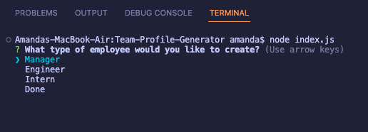
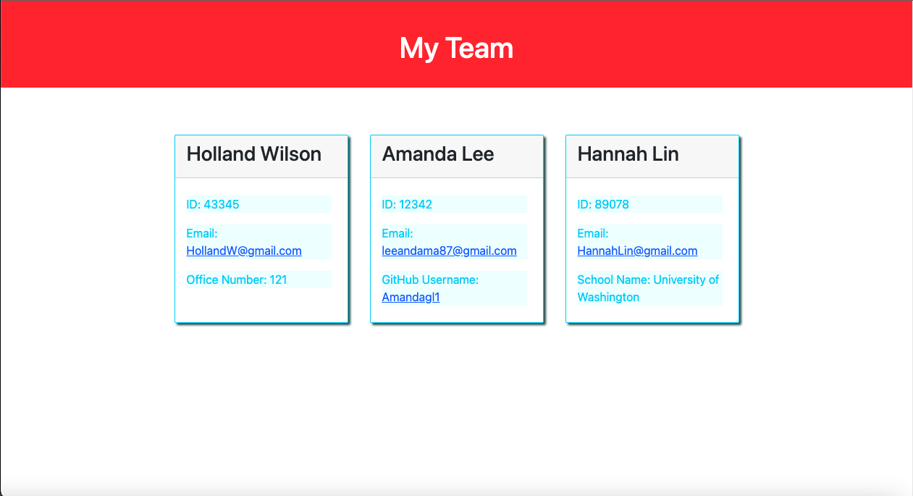

# Team Profile Generator


## Description

- This project was created so that developers can create cards for each of their team members.
- This is a team profile generator that organizes a team. Each member has a different role(E.g. manager(s), engineer(s), and/or intern(s)).
- I built this generator because it makes it easier for team members' information to be consolidated into a single file.
- I practiced using node.js, npm install(e.g. commands such as 'npm i inquirer@8.2.4 express', installs the modules for inquirer and express), etc.  
  
  **The command** 
  ```
  npm init -y
  ```
  **is also used to create a package.json**


## License
Read more about the license here: [ICS](https://choosealicense.com/licenses/isc/)

## Tests

To test the application, run this code in an intergrated terminal!
```
npm start
```

## Usage
Once you run the test command in an intergrated terminal, you'll see this prompt!  



## Demo (Generated HTML)


## Walkthrough
[Video Walkthrough](https://drive.google.com/file/d/10qJ9pZtPmJBWpFdSVpwHAyd1Tmjz55kB/view)

## Contact

### Questions? Reach me here:  
Github: Amandagl1  
Email: leeandama87@gmail.com

